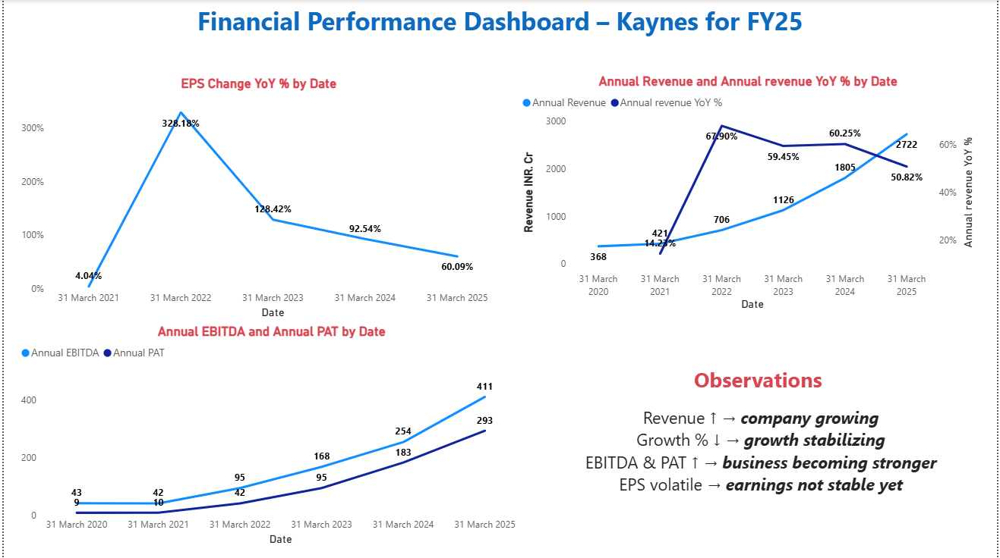

#  Kaynes Financial Performance Dashboard (Power BI)

##  Overview

This project analyzes the financial performance of Kaynes Technology using Power BI. It focuses on key financial metrics such as Revenue, EBITDA, PAT, and growth rates.

##  Key Insights

* Revenue grew from ₹368 Cr (FY20) to ₹2,722 Cr (FY25)
* YoY growth peaked early and is now stabilizing (~50%)
* EBITDA and PAT show consistent improvement
* EPS growth is volatile but overall upward

## Dashboard preview 

## Tools Used

* Power BI (Dashboard & Visualization)
* Power Query (Data Cleaning)
* DAX (YoY, QoQ Calculations)

##  Project Highlights

* Built interactive financial dashboard
* Created time-based measures (YoY, QoQ)
* Converted raw financial data into insights

## Files

* `.pbix` → Power BI dashboard file
* `.png` → Dashboard preview

